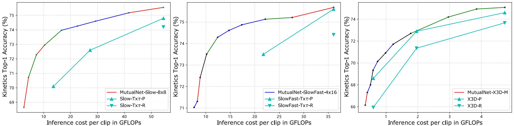

# MutualNet: Adaptive ConvNet via Mutual Learning from Network Width and Resolution (ECCV'20 Oral, TPAMI) [[ECCV]](https://www.ecva.net/papers/eccv_2020/papers_ECCV/papers/123460290.pdf) [[TPAMI]](https://arxiv.org/abs/2105.07085v2)

# Updates
**MutualNet is extended to 3D (spatiotemporal) networks for video action recognition.** We apply MutualNet to state-of-the-art ConvNet based video models such as SlowFast and X3D. An illustration of the model structure is shown below
<p></p>

We achieve runtime adaptive action recognition while outperforming previous state-of-the-arts. The results based on **Slow-only**, **SlowFast** and **X3D** networks are shown below
<p></p>

MutualNet achieves substantially better accuracy-efficiency trade-off compared to previous state-of-the-art ConvNet based video models as shown below
<p></p>

For more details and results, please check our TPAMI version [here](https://arxiv.org/abs/2105.07085v2).

# Abstract
This work proposes a method to train a network that is executable at dynamic resource constraints (e.g., FLOPs) during runtime. The proposed mutual learning scheme for input resolution and network width significantly improves the accuracy-efficiency tradeoffs over [Slimmable Networks](https://github.com/JiahuiYu/slimmable_networks) on various tasks such as image classification, object detection and instance segmentation. The method is also promising to serve as a plug-and-play strategy to boost a single network. It substantially outperforms a set of popular data augmentation and regularization methods. The overall framework is shown below. 

<p></p>

We feed different sub-networks with different scaled images. This allows each sub-network to learn multi-scale representations from both network scale and input scale as illustrated below.

<p></p>

# Install
- PyTorch 1.0.1, torchvision 0.2.2, Numpy, pyyaml 5.1.
- Follow the PyTorch [example](https://github.com/pytorch/examples/tree/master/imagenet) to prepare ImageNet dataset.
# Run
## Training
To train MobileNet v1, run the codes below
```
python train.py app:apps/mobilenet_v1.yml
```
Training hyperparameters are in the .yml files. `width_mult_list` is just used to print training logs for corresponding network widths. During testing, you can assign any desired width between the width lower bound and upper bound. To train other models, just use the corresponding .yml files.
## Testing

Modify `test_only: False` to `test_only: True` in .yml file to enable testing. 

Modify `pretrained: /PATH/TO/YOUR/WEIGHTS` to assign trained weights.

Modify `width_mult_list` to test more network widths.
```
python train.py app:apps/mobilenet_v1.yml
```

Note that this is to test the performance of all width-resolution configuration. You can obtain the query table by choosing the best-performed configuration at certain contraints (FLOPs). The query tables that we obtained for MobileNet v1 and MobileNet v2 are shown below.

MobileNet v1:

|MFLOPs|569|518|466|418|380|342|309|269|239|215|187|166|146|127|111|76|63|41|30|21|13|
|------|---|---|---|---|---|---|---|---|---|---|---|---|---|---|---|--|--|--|--|--|--|
|Width-Reso|1.0-224|1.0-0.95|1.0-0.9|1.0-192|0.95-192|0.9-192|0.85-192|0.8-192|0.75-192|0.85-160|0.8-160|0.75-160|0.7-160|0.65-160|0.6-160|0.5-160|0.45-160|0.35-160|0.25-192|0.25-160|0.25-128|
|Acc|72.4|71.7|71.2|70.9|70.6|70.2|69.7|69.1|68.4|67.7|67.2|66.5|65.6|64.7|63.5|60.3|58.9|54.4|52.7|50.1|45.5|

MobileNet v2:

|MLOPs|300|284|269|254|221|209|198|187|164|154|128|107|89|84|57|
|-----|---|---|---|---|---|---|---|---|---|---|---|---|--|--|--|
|Width-Reso|1.0-224|0.95-224|0.9-224|0.85-224|1.0-192|0.95-192|0.9-192|0.85-192|0.8-192|0.75-192|0.7-192|0.75-160|0.7-160|0.85-128|0.7-128|
|Acc|72.9|72.7|72.4|72.0|71.8|71.6|71.4|71.0|70.4|70.1|69.6|68.3|67.6|65.8|64.2|

For deployment, you only need to keep the model weights and the query table, where the size of the query table is negligible. So the memory footprint (#params) is the same as a single model. If you want a more fine-grained query table, you can test with a smaller width stepsize.
# Results and model weights
For those who do not have access to Google Drive: here is the link to all model weights in [[BaiduYun]](https://pan.baidu.com/s/1q4SLaLZJiw8D2--YJlrAAQ). The extraction code is 4y6m.
## Performance over the whole FLOPs specturm
Comparison with [US-Net](http://openaccess.thecvf.com/content_ICCV_2019/html/Yu_Universally_Slimmable_Networks_and_Improved_Training_Techniques_ICCV_2019_paper.html) under different backbones on ImageNet.

Model weights: [[MobileNet v1]](https://drive.google.com/open?id=1A36ZJCrkKXQX8T0vZR9kRN5P1fjIDMu2), [[MobileNet v2]](https://drive.google.com/open?id=1GIe5Mpbkc2CptvPbqcEgJtPSoP2WYkNm)

## Scaling up model compared with EfficienNet
The best model scaling on MobileNet v1 compared with [EfficientNet](http://proceedings.mlr.press/v97/tan19a.html)
|Model|Best Model Scaling|FLOPs|Top-1 Acc|
|-----|------------------|-----|---------|
[EfficientNet](http://proceedings.mlr.press/v97/tan19a.html)|*d=1.4, w=1.2, r=1.3*|2.3B|75.6%|
MutualNet ([Model](https://drive.google.com/open?id=1NdygihO3AxEp7f9XyhofoYz_64ki_Sma))|*w=1.6, r=1.3*|2.3B|**77.1%**|
## Boosting performance of a single network
Top-1 accuracy on Cifar-10 and Cifar-100
|WideResNet-28-10|GPU search hours|Cifar-10|Cifar-100|
|----------------|:--------------:|:------:|:-------:|
|[Baseline](https://arxiv.org/abs/1605.07146)|0|96.1%|81.2%|
|[Cutout](https://arxiv.org/abs/1708.04552)|0|96.9%|81.6%|
|[Mixup](https://arxiv.org/abs/1710.09412)|0|97.3%|82.5%|
|[AutoAugment](http://openaccess.thecvf.com/content_CVPR_2019/html/Cubuk_AutoAugment_Learning_Augmentation_Strategies_From_Data_CVPR_2019_paper.html)|5000|**97.4%**|82.9%|
|[Fast AutoAugment](http://papers.nips.cc/paper/8892-fast-autoaugment)|3.5|97.3%|82.7%|
|MutualNet|0|97.3%|**83.8%**|

Compared with state-of-the-art performance boosting methods on ImageNet
|ResNet-50|Additional Cost|Top-1 Acc|
|---------|:-------------:|:-------:|
|[Baseline](http://openaccess.thecvf.com/content_cvpr_2016/html/He_Deep_Residual_Learning_CVPR_2016_paper.html)| \ |76.5%|
|[Cutout](https://arxiv.org/abs/1708.04552)| \ |77.1%|
|[Mixup](https://arxiv.org/abs/1710.09412)| \ |77.9%|
|[CutMix](https://arxiv.org/abs/1905.04899)| \ |**78.6%**|
|[KD](https://openreview.net/forum?id=B1ae1lZRb)|Teacher Network|76.5%|
|[SENet](http://openaccess.thecvf.com/content_cvpr_2018/html/Hu_Squeeze-and-Excitation_Networks_CVPR_2018_paper.html)|SE Block|77.6%|
|[AutoAugment](http://openaccess.thecvf.com/content_CVPR_2019/html/Cubuk_AutoAugment_Learning_Augmentation_Strategies_From_Data_CVPR_2019_paper.html)|15000 GPU search hours|77.6%|
|[Fast AutoAugment](http://papers.nips.cc/paper/8892-fast-autoaugment)|450 GPU search hours|77.6%|
|MutualNet ([Model](https://drive.google.com/open?id=1Br3o58lZqyGzZaqZpqhAfUJhMawFS_Pc))| \ |**78.6%**|
# Citation
If you find this useful in your work, please consider citing,
```
@inproceedings{yang2020mutualnet,
  title={MutualNet: Adaptive ConvNet via Mutual Learning from Network Width and Resolution},
  author={Yang, Taojiannan and Zhu, Sijie and Chen, Chen and Yan, Shen and Zhang, Mi and Willis, Andrew},
  booktitle={European Conference on Computer Vision},
  pages={299--315},
  year={2020},
  organization={Springer}
}
```
# Reference
\- The code is based on the implementation of [Slimmable Networks](https://github.com/JiahuiYu/slimmable_networks).
